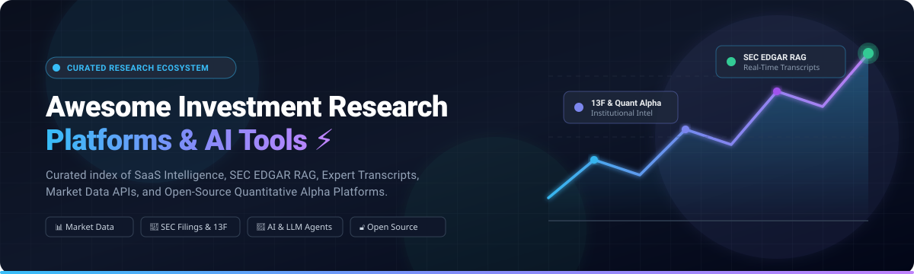
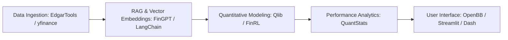

# Awesome Investment Research Platforms 🚀

  

  
  
  
  
  
  
  

---

## 🌟 Top Investment Research Platform Ecosystem

> **A Curated Directory of SaaS Market Intelligence Platforms, AI Financial Agents, SEC EDGAR RAG Pipelines, and Open-Source Quantitative Research Infrastructure.**  
> *Focused on Equity Research, Filing & Transcript Analysis, Alternative Data, Valuation Models, and Algorithmic Alpha.*  
> **📅 Last updated: August 2026**

This repository tracks notable **SaaS platforms** 🏢 and **open-source projects** 💻 for **Investment Research**. These tools empower fundamental equity analysts, quant researchers, portfolio managers, and retail investors to query SEC filings, parse earnings call transcripts, leverage Wall Street consensus estimates, backtest quantitative signals, and harness AI-driven financial search agents.

---

## 📑 Table of Contents
- [🏢 SaaS & Hosted Platforms](#-saashosted-platforms)
- [💻 Open-Source GitHub Projects](#-open-source-github-projects)
- [🛠️ Frameworks & Architecture for Custom Stacks](#-frameworks--architecture-for-custom-stacks)
- [🤝 How to Contribute](#-how-to-contribute)
- [📈 Star History](#-star-history)
- [⚠️ Disclaimer](#️-disclaimer)

---

## 🏢 SaaS/Hosted Platforms

> **📊 Market Overview:** The global investment research and financial market data software market is estimated at **~$35B – $45B+ in 2026** (projected to reach **$72B+ by 2034 at an ~8.5%–14% CAGR**), operating as a **moderately concentrated, oligopolistic market** where legacy financial behemoths (S&P Global, Morningstar/PitchBook) and high-growth AI intelligence aggregators (AlphaSense) capture majority enterprise spend, alongside focused niche innovators.

| Platform | Company Size (Valuation / Revenue) | Description | Starting Tier Pricing | Free Tier / Free Trial Limits |
| :--- | :--- | :--- | :--- | :--- |
| **[S&P Capital IQ Pro](https://www.spglobal.com/marketintelligence/)** | **~$150B+ Market Cap** ($14B+ Rev, S&P Global) | Comprehensive institutional fundamental data, screening, financial modeling, and Excel plug-in analytics. | Starts at ~$12,000/seat/yr (Core desktop license; scales upwards based on data feeds/modules) | **7-day to 14-day trial** upon qualified sales request; limited dataset export/screening queries (no permanent free tier) |
| **[PitchBook](https://pitchbook.com/)** | **~$14B+ Market Cap** (Parent: Morningstar; PitchBook ARR >$500M+) | Global private capital market database covering VC, PE, M&A transactions, fund performance, and valuations. | Starts at ~$20,000/seat/yr (3-user starter bundle typically ~$20,000 – $24,000/yr) | **7-day trial** via sales qualification / demo; capped search results and restricted raw data exports (no permanent free tier) |
| **[AlphaSense](https://www.alpha-sense.com/)** | **$7.5B Valuation** ($600M+ ARR, 2026) | AI-powered market intelligence & search covering SEC filings, transcripts, broker research, expert calls, and news. | Starts at ~$10,000 – $20,000/seat/yr (Core enterprise tier; quotes scale with expert call & broker add-ons) | **14-day free trial** upon demo/sales request; full document search & AI summaries (export/download caps apply, no permanent free tier) |
| **[Tegus](https://www.tegus.com/)** | **$930M Acquisition** (Acquired by AlphaSense; $100M+ ARR) | Primary research platform featuring a vast library of expert interview transcripts and financial models (now part of AlphaSense). | Starts at ~$20,000 – $25,000/seat/yr (Annual platform license) | **7-day trial / sample call bundle** arranged via sales consultation; access to sample transcript database (no permanent free tier) |
| **[Visible Alpha](https://visiblealpha.com/)** | **~$500M Acquisition** (Acquired by S&P Global, 2024) | Consensus forecasts, detailed financial estimates, and standardized operating metrics/KPI models. | Starts at ~$10,000 – $15,000/yr (Contract-based via S&P Global; scales by coverage universe & seat count) | **14-day pilot/trial** arranged via sales demo; limited to sample coverage universe (no permanent free tier) |
| **[Sentieo](https://www.sentieo.com/)** | **~$150M Acquisition** (Acquired by AlphaSense; $20M+ ARR) | Financial search engine, filing analysis, and research notebook workspace (integrated into AlphaSense platform). | Starts at ~$10,000/seat/yr (Sold via AlphaSense enterprise subscriptions) | **14-day free trial** upon sales request; access to document search and notebook features (no permanent free tier) |
| **[Mosaic Smart Data](https://www.mosaicsmartdata.com/)** | **~$50M+ Acquisition** (Acquired by Behavox, 2025) | Real-time FICC data analytics and transaction intelligence platform for banks and buy-side trading desks. | Starts at ~$25,000/yr (Enterprise institutional subscription via Behavox sales) | **30-day free trial** for Smart Markets data intelligence service (requires corporate email verification; no permanent free tier) |
| **[Koyfin](https://www.koyfin.com/)** | **~$20M – $40M Valuation** (Series A/B; millions in ARR) | Market data, financial charting, equity screening, macroeconomic dashboards, and portfolio analytics. | **$39/mo** (Plus tier, billed annually) / $79/mo (Premium tier) | **Free forever plan**: Max 2 watchlists, 2 screens, 2 custom dashboards, 2 years financial statements, 1 year estimates, 1 portfolio |
| **[BamSEC](https://www.bamsec.com/)** | **Bootstrapped / Profitable** (~$5M – $10M ARR) | Specialist tool for fast SEC EDGAR filing search, table extraction to Excel, and earnings call transcript navigation. | **$69/mo** (Pro tier, billed annually) | **7-day free trial** for Pro; limited transcript access during trial per S&P licensing agreements. Free tier offers basic search & SEC viewing only |
| **[Yewno](https://www.yewno.com/)** | **~$15M – $30M Funded** (Venture-backed AI startup) | AI-powered knowledge graph and thematic investment research engine mapping company concepts and market themes. | **$59/mo** (Basic tier) / $149/mo (Premium tier with Strategy Builder) | **14-day free trial** on Yewno Edge with full access to thematic screening and graphs (no permanent free tier) |

---

## 💻 Open-Source GitHub Projects

Below are the most prominent open-source investment research engines, SEC EDGAR parsers, quantitative backtesters, and autonomous AI financial agents, **sorted in descending order of GitHub star count**:

- **[OpenBB](https://github.com/OpenBB-finance/OpenBB)** []  
  The leading open-source investment research terminal and Python SDK providing unified access to global equities, macro data, options, crypto, and SEC filings.

- **[ai-hedge-fund](https://github.com/virattt/ai-hedge-fund)** []  
  An autonomous AI-powered hedge fund proof-of-concept simulating collaboration between specialized research agents (Warren Buffett value agent, sentiment agent, valuation agent, risk manager).

- **[qlib](https://github.com/microsoft/qlib)** []  
  Microsoft's AI-oriented quantitative investment platform designed for alpha seeking, ML-driven factor modeling, risk modeling, and backtesting.

- **[dexter](https://github.com/virattt/dexter)** []  
  An autonomous agent for deep financial research, automated report synthesis, earnings dissection, and equity analysis.

- **[yfinance](https://github.com/ranaroussi/yfinance)** []  
  Widely used open-source Python library for downloading historical market prices, fundamental ratios, financial statements, and options data.

- **[FinGPT](https://github.com/AI4Finance-Foundation/FinGPT)** []  
  Open-source financial large language models (LLMs) and training pipelines democratizing automated Robo-advising, sentiment analysis, and market intelligence.

- **[FinRL](https://github.com/AI4Finance-Foundation/FinRL)** []  
  Deep reinforcement learning framework for quantitative finance, automated strategy backtesting, portfolio allocation, and dynamic trading.

- **[quantstats](https://github.com/ranaroussi/quantstats)** []  
  Portfolio analytics library providing comprehensive performance metrics, Sharpe/Sortino ratios, drawdown analysis, and visual tear sheets.

- **[EdgarTools](https://github.com/dgunning/edgartools)** []  
  High-quality Python library for reading and analyzing SEC EDGAR filings (10-K, 10-Q, 8-K, 13F, Forms 3/4/5, XBRL financials) with clean, typed APIs.

- **[wallstreetlocal](https://github.com/leftmove/wallstreetlocal)** []  
  Free and open-source platform for exploring 13F institutional ownership and holdings of top hedge funds and asset managers.

- **[FinSight](https://github.com/vishwasg217/fin-sight)** []  
  AI-powered financial research assistant combining SEC filings, market data, and RAG to answer queries and summarize company developments.

- **[finance-agent](https://github.com/kamathhrishi/finance-agent)** []  
  Open-source multi-agent system answering questions over earnings calls, SEC filings, and financial news with citation verification.

- **[FinanceLake](https://github.com/FinanceLake/financelake)** []  
  Open-source data platform for ingesting, processing, and analyzing financial and market data using scalable cloud-native architectures.

- **[stock-pulse-ai](https://github.com/SiinXu/stock-pulse-ai)** []  
  Local-first, multi-market AI stock analysis and research workbench generating structured investment reports under user control.

---

## 🛠️ Frameworks & Architecture for Custom Stacks

- **SEC EDGAR downloaders & parsers**: Mature libraries for bulk and incremental filing retrieval and XBRL extraction.
- **13F / Ownership trackers**: Tools that parse and visualize institutional holdings over time.
- **Financial statement & ratio engines**: Open libraries for calculating standard fundamental metrics from filings or data feeds.
- **News & transcript pipelines**: Scrapers and processors for earnings call transcripts and financial news (where legally permissible).
- **Vector search & RAG stacks**: Combinations of embedding models, vector databases, and LLMs tailored to financial documents.
- **Quantitative Alpha & Event Studies**: Academic and quant research repositories focused on filing-based alpha, sentiment analysis, and backtesting.

---

## 🤝 How to Contribute

1. 🍴 Fork the repository.
2. 📝 Add or edit entries in [README.md](README.md) following the existing structured format.
3. 🔍 Ensure: Platform/Repo Name, Link, Description, Star Badge (for open source), and factual Pricing/Size metadata.
4. 🚀 Submit a Pull Request with a clear, concise title and description!

⭐ **Star the repo** if you find it valuable for your investment workflow!

---

## 📈 Star History

---

## ⚠️ Disclaimer

- 💡 This is a **community-curated** list — provided for informational and educational purposes only; not an endorsement or investment recommendation.
- ⚖️ Investment research tools process financial data and assist analysis. Users are solely responsible for verifying data accuracy and ensuring compliance with securities regulations, data licensing agreements, and fair-use guidelines (such as SEC EDGAR rate limits).
- 🛡️ Open-source tools do not constitute financial advice. Always verify data independently and consult licensed financial advisors where appropriate.

---

  <b>Built for equity analysts, portfolio managers, quant researchers, and independent investors who value transparent, programmable research infrastructure. 🚀</b>

